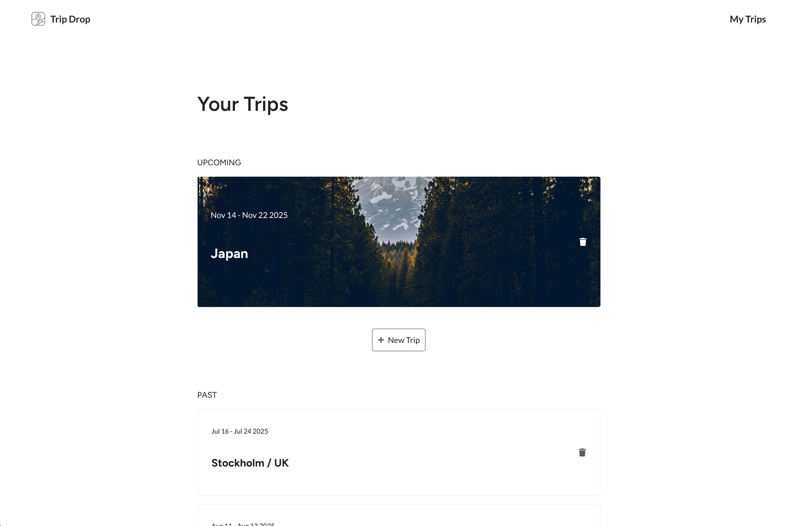
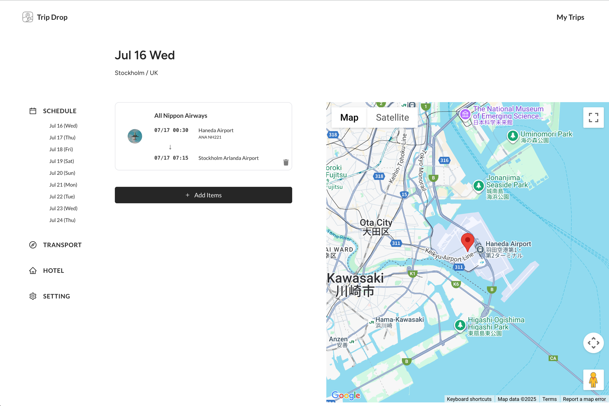
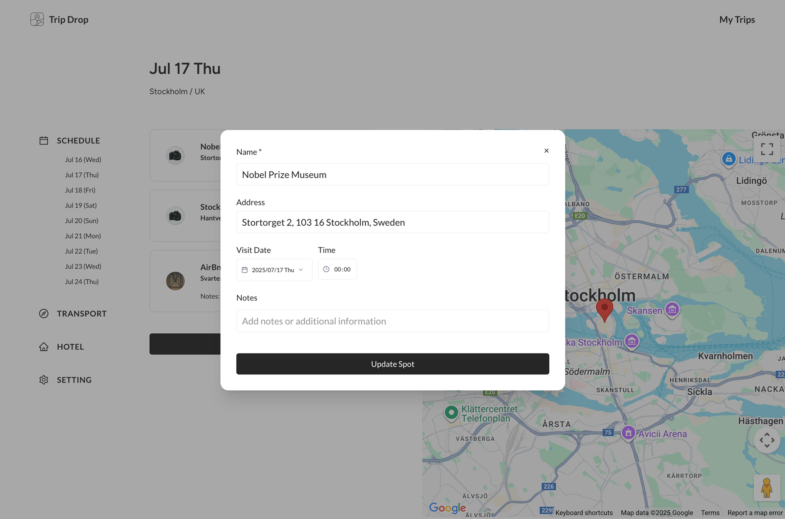
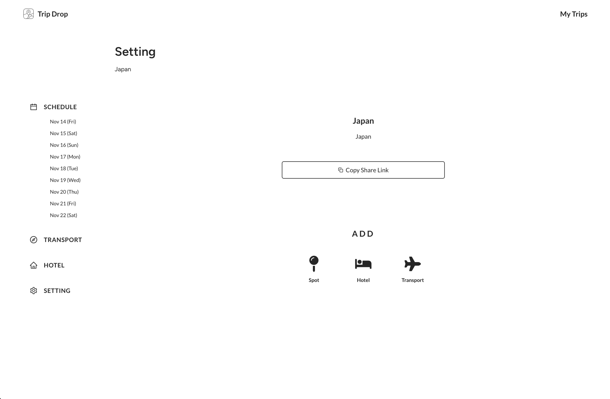
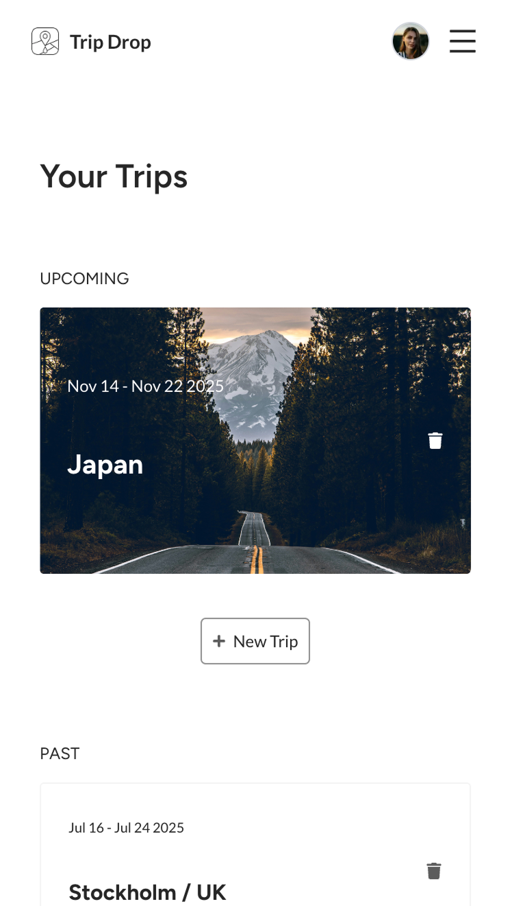
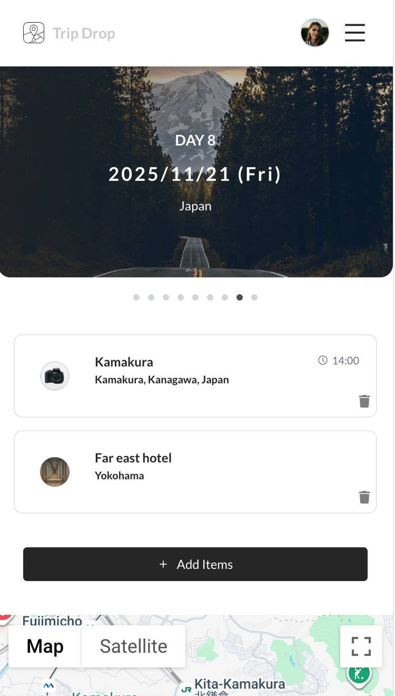
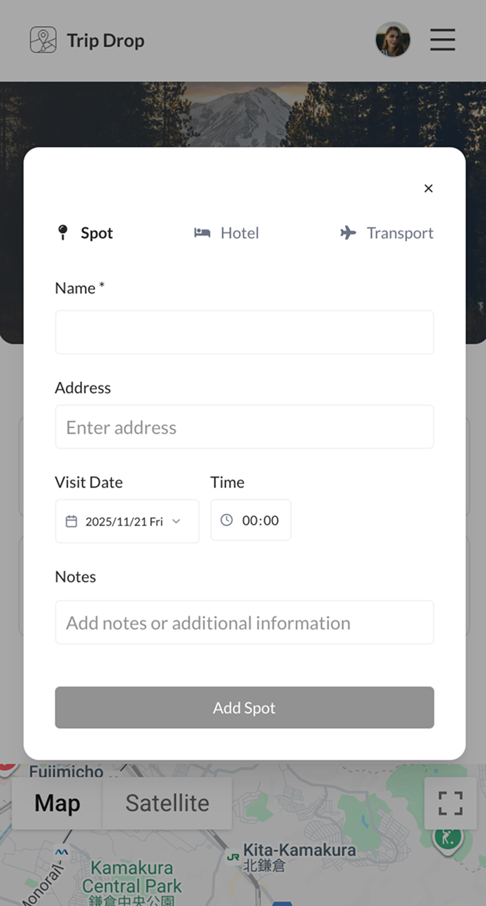
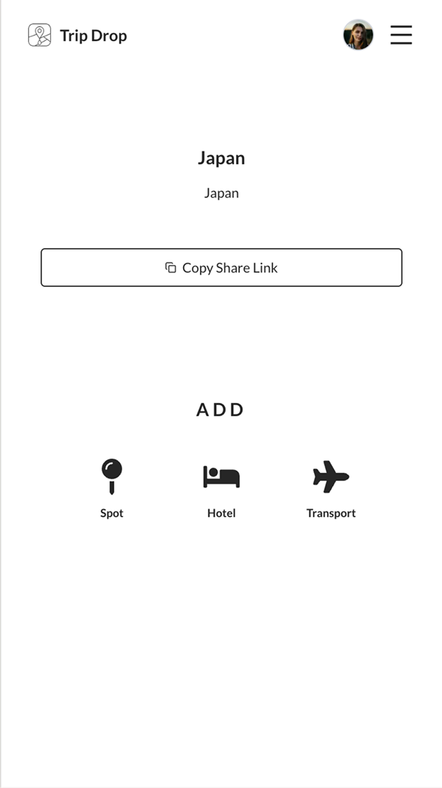

# Trip Drop

A collaborative trip planning and management application built with Next.js 15, React 19, and Supabase. Plan your trips, share them with friends, and manage your itinerary all in one place.

## Features
- **Collaborative Trip Planning**: Create trips, share them with friends via password-protected links, and manage day-by-day itineraries together
- **Comprehensive Itinerary Management**: Add spots, hotels, and transportation with Google Places integration and view everything on interactive maps
- **Real-time Collaboration**: Work together with role-based permissions, timezone support, and secure authentication powered by Supabase

<!-- ### 🧳 Trip Management
- Create and manage multiple trips with custom titles and descriptions
- Set trip dates with timezone support
- Password-protected trip sharing
- Organize trips into "Upcoming" and "Past" categories

### 👥 Collaboration
- Invite friends to join your trips with a share password
- Role-based permissions (owner/member)
- Real-time updates for all trip members
- Member management with customizable permissions

### 📅 Schedule Management
- Day-by-day itinerary planning
- Visual schedule with date navigation
- Automatic trip day generation based on date range
- Custom day titles

### 🗺️ Places & Spots
- Add tourist spots and attractions to your itinerary
- Google Places API integration for location search
- Store visit dates and times with timezone support
- View spots on an interactive Google Map
- Store location data using PostGIS for geospatial queries

### 🏨 Accommodation
- Manage hotel bookings and stays
- Track check-in and check-out times
- Link hotels to specific trip days
- Store booking references and notes
- Support for multi-day stays

### 🚌 Transportation
- Add transportation details (flights, trains, etc.)
- Track departure and arrival locations
- Store booking references
- Time-based scheduling

### 🗺️ Interactive Maps
- Visualize all trip locations on Google Maps
- Automatic map centering based on selected spots
- Responsive map view for mobile and desktop

### 🔐 Security
- Supabase Authentication for secure user management
- Row Level Security (RLS) policies for data protection
- Password-protected trip sharing
- Secure API routes with Bearer token authentication -->

<table>
  <tr>
    <td align="center" valign="top"></td>
    <td align="center" valign="top"></td>
    <td align="center" valign="top"></td>
    <td align="center" valign="top"></td>
  </tr>
</table>

<table>
  <tr>
    <td align="center" valign="top"></td>
    <td align="center" valign="top"></td>
    <td align="center" valign="top"></td>
    <td align="center" valign="top"></td>
  </tr>
</table>

## Tech Stack

### Frontend
- **Next.js 15** - React framework with App Router
- **React 19** - UI library
- **TypeScript** - Type safety
- **Tailwind CSS** - Utility-first CSS framework
- **shadcn/ui** - UI component library
- **Zustand** - State management
- **SWR** - Data fetching and caching
- **Axios** - HTTP client
- **date-fns** - Date manipulation
- **Lucide React** - Icon library

### Backend
- **Supabase** - Backend as a Service
  - PostgreSQL database
  - Authentication
  - Row Level Security (RLS)
  - PostGIS extension for geospatial data
- **Next.js API Routes** - Serverless API endpoints

### External Services
- **Google Places API** - Location search and details
- **Google Maps API** - Interactive maps

## Getting Started

### Prerequisites

- Node.js 18+ and npm
- Supabase account and project
- Google Cloud Platform account with Places API and Maps API enabled
